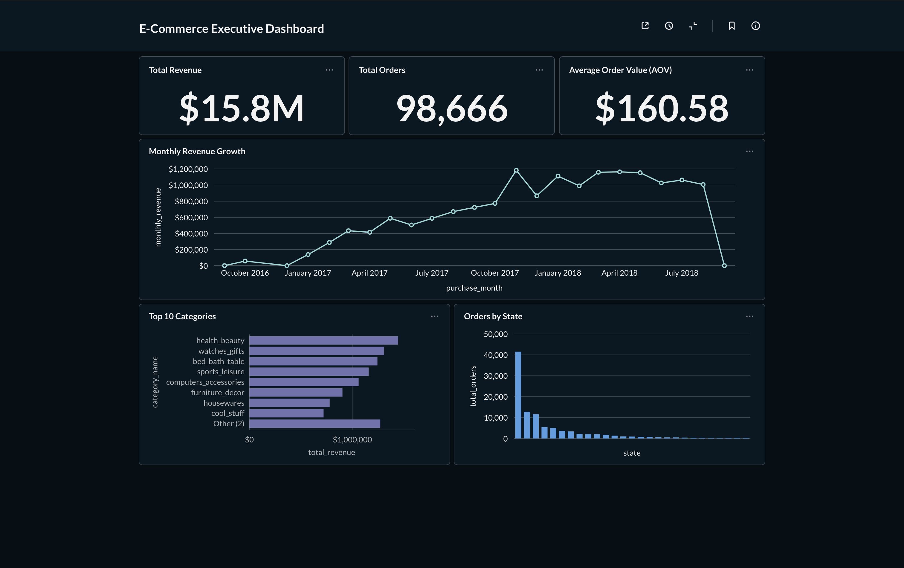
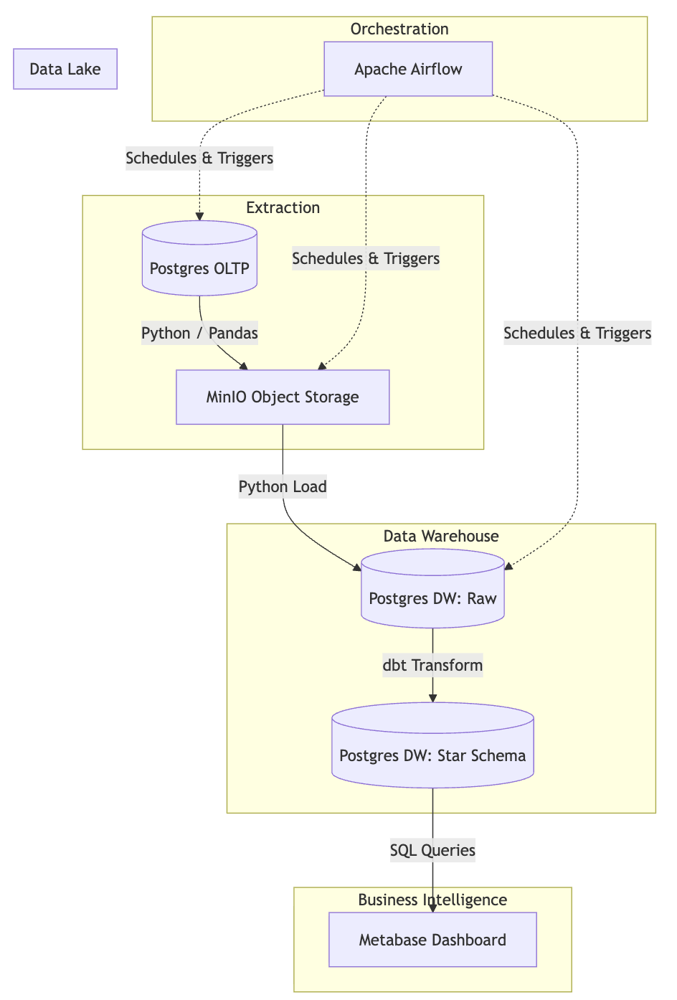
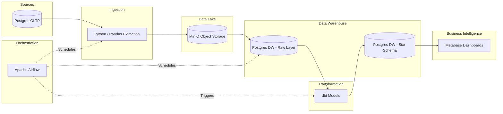

# E-Commerce ELT Pipeline




This project simulates a high-volume e-commerce business environment where transactional data is generated continuously. Instead of running slow, complex analytical queries directly against the production database, this solution implements an automated ELT (Extract, Load, Transform) pipeline. It extracts raw operational data, stages it securely in a Data Lake, and uses dbt to model a highly efficient Star Schema in a PostgreSQL Data Warehouse.

The pipeline is fully containerized and orchestrated via Apache Airflow to handle daily incremental loads without manual intervention.

## Business Problem

An e-commerce company processes thousands of orders daily, resulting in heavily normalized transactional data scattered across multiple operational tables. Previously, analysts struggled to generate daily reports because:
- Querying the production OLTP database directly caused performance bottlenecks.
- Complex `JOIN` operations across massive tables resulted in slow dashboard load times.
- There was no historical tracking or way to handle late-arriving delivery updates efficiently.
- Rebuilding analytical tables from scratch every day was wasting compute resources.

The company needed a robust, automated Modern Data Stack to:
- Safely extract data without impacting production.
- Model the data into a business-ready Star Schema tracking Sales, Payments, and Reviews.
- Intelligently process only *new* or *updated* records (Incremental processing).
- Serve a fast, highly available dashboard for executive metrics.

## The Dataset: Olist Brazilian E-Commerce

This project utilizes the **[Brazilian E-Commerce Public Dataset by Olist](https://www.kaggle.com/datasets/olistbr/brazilian-ecommerce)**, a widely recognized real-world dataset hosted on Kaggle. 

**Why this dataset?**
It contains roughly 100,000 orders made across multiple marketplaces in Brazil from 2016 to 2018. Its heavily normalized structure—spread across 8 distinct tables—perfectly mirrors a complex, messy operational database. This makes it an ideal candidate for demonstrating robust ELT extraction, data quality testing, and Star Schema modeling.

## Architecture & Tech Stack

### Pipeline Architecture
<!--  -->


| Component               | Technology                  |
| ----------------------- | --------------------------- |
| Orchestration           | Apache Airflow              |
| Extraction              | Python                      |
| Data Lake (Storage)     | MinIO (S3-Compatible)       |
| Data Warehouse          | PostgreSQL                  |
| Transformation & Testing| dbt (Data Build Tool)       |
| Business Intelligence   | Metabase                    |
| Infrastructure          | Docker & Docker Compose     |

## Key Engineering Highlights

### 1. Advanced dbt Incremental Modeling
Instead of relying on computationally expensive full-table scans, the `fact_sales` model utilizes dbt's `incremental` materialization. 
* Implemented a synthetic `updated_at` high-water mark.
* The pipeline efficiently processes only new orders and late-arriving delivery updates using complex `MERGE` logic, saving compute resources and reducing pipeline execution time.

### 2. Idempotent Data Lake Architecture
Utilized **MinIO** as an intermediate staging layer. By writing data to object storage before loading it into the warehouse, the pipeline ensures fault tolerance and allows for historical backfilling without hammering the source transactional database.

### 3. Fully Containerized Environment
The entire stack (Airflow, MinIO, Postgres OLTP, Postgres DW, and Metabase) is defined in a single `docker-compose.yml` file, ensuring perfect environment parity and isolated container networking.

## Project Structure

```text
ECOMMERCE_ELT_PROJECT/
├── dags/                       # Airflow DAGs for orchestrating the ELT workflow
│   └── elt_pipeline_minio.py
├── dbt_ecommerce/              # dbt project containing SQL models and schema tests
│   ├── models/                 
│   │   ├── staging/            # Base views cleaning raw DW data
│   │   └── marts/              # Final Star Schema (fact_sales, dim_products)
├── docker-compose.yml          # Containerized Infrastructure as Code
├── init_oltp_db.py             # Simulates production DB seeding
├── assets/                     # Architecture diagrams and dashboard screenshots
└── requirements.txt
```

## How to Run Locally
**1. Clone the repository:**
```bash
git clone https://github.com/rtmagar/ecommerce-elt-pipeline.git
cd ecommerce_elt_project
```
**2. Download the Raw Data:**

Download the Olist E-Commerce Dataset from Kaggle. Create a folder named ```raw_data``` in the root directory. Extract the downloaded CSVs into the ```raw_data``` folder.

**3. Update the Airflow Configuration:**
Before starting the containers, update the Airflow startup command to ensure the default admin credentials (`airflow` / `airflow`) are created automatically. 
Open the `docker-compose.yml` file, locate the `airflow:` service at the bottom, and replace the existing `command:` line with this:
```yaml
    command: >
      bash -c "pip install -r /requirements.txt && 
      airflow db migrate && 
      airflow users create --username airflow --password airflow --firstname Air --lastname Flow --role Admin --email admin@example.com || true && 
      airflow standalone"
```
      
**4. Start the infrastructure (Docker):**
Ensure Docker Desktop is running, then spin up the stack:
```bash
docker compose up -d
```
**4. Initialize the source (production) database:**
```bash
python -m venv venv
source venv/bin/activate  # On Windows use: venv\Scripts\activate
pip install -r requirements.txt
python init_oltp_db.py
```
**5. Trigger the Airflow DAG:**
Navigate to ```http://localhost:8080``` (credentials: ```airflow``` / ```airflow```). Enable and trigger the ```ecommerce_elt_minio_postgres``` DAG.

**6. Configure dbt and Run Transformations:**
Before running dbt, you must configure your local profile.

Create a ```profiles.yml``` file in your ```~/.dbt/``` directory (or inside the ```dbt_ecommerce``` folder).

Add the following connection details:
```bash
ecommerce_elt:
  target: dev
  outputs:
    dev:
      type: postgres
      host: localhost
      user: dw_admin
      password: dw_password
      port: 5434
      dbname: analytics_warehouse
      schema: public
      threads: 4
```

**7. Run the dbt models:**
Ensure Docker Desktop is running, then spin up the stack:
```bash
cd dbt_ecommerce
dbt run --full-refresh  # Initial build to establish schema
dbt test                # Run data quality assertions
```

**8. Explore the Data (Optional):**
To explore the finalized Star Schema and build your own visualizations:
1. Navigate to `http://localhost:3000` to access the Metabase UI.
2. Set up an admin account.
3. Add a new PostgreSQL database connection using:
   - **Host:** `postgres-dw`
   - **Port:** `5432`
   - **Database Name:** `analytics_warehouse`
   - **Username:** `dw_admin`
   - **Password:** `dw_password`

*(Note: The pre-built dashboard is saved locally. You can view the final visualization screenshots at the top of this README).*
