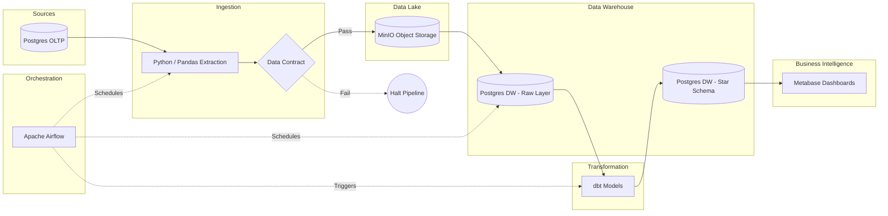

# E-Commerce ELT Pipeline


This project simulates a high-volume e-commerce business environment where transactional data is generated continuously. Instead of running slow, complex analytical queries directly against the production database, this solution implements an automated ELT (Extract, Load, Transform) pipeline. It extracts raw operational data, strictly validates it against Data Contracts, stages it securely in a Data Lake, and uses dbt to model a highly efficient Star Schema in a PostgreSQL Data Warehouse.

The pipeline is fully containerized and orchestrated via Apache Airflow to handle daily incremental loads without manual intervention.

## Business Problem

An e-commerce company processes thousands of orders daily, resulting in heavily normalized transactional data scattered across multiple operational tables. Previously, analysts struggled to generate daily reports because:
- Querying the production OLTP database directly caused performance bottlenecks.
- Complex `JOIN` operations across massive tables resulted in slow dashboard load times.
- There was no historical tracking or way to handle late-arriving delivery updates efficiently.
- Rebuilding analytical tables from scratch every day was wasting compute resources.
- Upstream schema changes (e.g., software engineers modifying production tables) frequently broke downstream dashboards silently.

The company needed a robust, automated Modern Data Stack to:
- Safely extract data without impacting production.
- Enforce strict Data Contracts to prevent silent schema drift.
- Model the data into a business-ready Star Schema tracking Sales, Payments, and Reviews.
- Intelligently process only *new* or *updated* records (Incremental processing).
- Serve a fast, highly available dashboard for executive metrics.

## The Dataset: Olist Brazilian E-Commerce

This project utilizes the **[Brazilian E-Commerce Public Dataset by Olist](https://www.kaggle.com/datasets/olistbr/brazilian-ecommerce)**, a widely recognized real-world dataset hosted on Kaggle. 

**Why this dataset?**
It contains roughly 100,000 orders made across multiple marketplaces in Brazil from 2016 to 2018. Its heavily normalized structure—spread across 8 distinct tables—perfectly mirrors a complex, messy operational database. This makes it an ideal candidate for demonstrating robust ELT extraction, data quality testing, and Star Schema modeling.

## Architecture & Tech Stack

### Pipeline Architecture
<!--  -->


| Component                   | Technology                  |
| -----------------------     | --------------------------- |
| Orchestration               | Apache Airflow              |
| Extraction                  | Python                      |
| Data Quality (Ingestion)    | SON Schema (Data Contracts) |
| Data Lake (Storage)         | MinIO (S3-Compatible)       |
| Data Warehouse              | PostgreSQL                  |
| Transformation & Testing    | dbt (Data Build Tool)       |
| Business Intelligence       | Metabase                    |
| Infrastructure              | Docker & Docker Compose     |


## Key Engineering Highlights

### 1. Shift-Left Data Quality (Data Contracts)
To protect the data lake from upstream schema drift, the pipeline enforces strict JSON-based Data Contracts at the point of extraction. Using jsonschema, the Airflow extraction task validates column names, data types, and enum constraints before data is serialized to Parquet. If an upstream software engineer introduces a breaking change (e.g., dropping a critical column), the pipeline halts immediately, preventing silent corruption of downstream BI dashboards.

### 2. Advanced dbt Incremental Modeling
Instead of relying on computationally expensive full-table scans, the `fact_sales` model utilizes dbt's `incremental` materialization. 
* Implemented a synthetic `updated_at` high-water mark.
* The pipeline efficiently processes only new orders and late-arriving delivery updates using complex `MERGE` logic, saving compute resources and reducing pipeline execution time.

### 3. Idempotent Data Lake Architecture
Utilized **MinIO** as an intermediate staging layer. By writing data to object storage before loading it into the warehouse, the pipeline ensures fault tolerance and allows for historical backfilling without hammering the source transactional database.

### 4. Fully Containerized Environment
The entire stack (Airflow, MinIO, Postgres OLTP, Postgres DW, and Metabase) is defined in a single `docker-compose.yml` file, ensuring perfect environment parity and isolated container networking.

## Project Structure
```text
ECOMMERCE_ELT_PROJECT/
├── dags/                       # Airflow DAGs for orchestrating the ELT workflow
│   ├── contracts/              # JSON Data Contracts defining strict schemas
│   │   └── orders.json
│   └── elt_pipeline_minio.py
├── dbt_ecommerce/              # dbt project containing SQL models and schema tests
│   ├── models/                 
│   │   ├── staging/            # Base views cleaning raw DW data
│   │   └── marts/              # Final Star Schema (fact_sales, dim_products)
├── docker-compose.yml          # Containerized Infrastructure as Code
├── init_oltp_db.py             # Simulates production DB seeding
├── assets/                     # Architecture diagrams and dashboard screenshots
└── requirements.txt
```
## How to Run Locally
**1. Clone the repository:**
```bash
git clone https://github.com/rtmagar/ecommerce-elt-pipeline.git
cd ecommerce-elt-pipeline
```
**2. Download the Raw Data:**

Download the Olist E-Commerce Dataset from Kaggle.

Create a folder named raw_data in the root directory.

Extract the downloaded CSVs into the raw_data folder.

**3. Start the infrastructure (Docker):**
Ensure Docker Desktop is running, then spin up the stack:
```bash
docker compose up -d
```
**4. Initialize the Local Environment & Source Database:**
To avoid dependency conflicts between Airflow's core providers and our local dbt engine, we install the core data-movement libraries first, followed by the local tools (`dbt-postgres` and `SQLAlchemy`).

```bash
python -m venv venv
source venv/bin/activate  # On Windows use: venv\Scripts\activate

# 1. Install the clean, core data libraries
pip install -r requirements.txt

# 2. Install dbt and the SQLAlchemy engine required by Pandas
pip install dbt-postgres==1.10.0 SQLAlchemy

# 3. Seed the source PostgreSQL database with Kaggle data
python init_oltp_db.py
```
**5. Trigger the Airflow DAG:**
Navigate to ```http://localhost:8080``` (credentials: ```airflow``` / ```airflow```). Enable and trigger the ```oltp_s3_olap_pipeline``` DAG. *Note: Watch the logs to see the Data Contract validation succeed before the upload to MinIO.*

**6. Verify the Data Lake (MinIO):**
Once the Airflow DAG runs successfully, you can verify that the raw data was successfully extracted and staged in the Data Lake.
1. Navigate to `http://localhost:9001` to access the MinIO Console.
2. Log in using the default credentials:
   - **Username:** `minioadmin`
   - **Password:** `minioadmin`
3. Click on the **Object Browser** to view the staging buckets and the newly landed raw data files.

**7. Configure dbt and Run Transformations:**
Before running dbt, you must configure your local profile.

Create a ```profiles.yml``` file in your ```~/.dbt/``` directory (or inside the ```dbt_ecommerce``` folder).

Add the following connection details:
```bash
dbt_ecommerce:
  target: dev
  outputs:
    dev:
      type: postgres
      host: localhost
      user: dw_admin
      password: dw_password
      port: 5434
      dbname: analytics_warehouse
      schema: public
      threads: 4
```

**8. Run the dbt models:**
Ensure Docker Desktop is running, then spin up the stack:
```bash
cd dbt_ecommerce
dbt deps
dbt run --full-refresh  # Initial build to establish schema
dbt test                # Run data quality assertions
```

**9. Explore the Data (Optional):**
To explore the finalized Star Schema and build your own visualizations:
1. Navigate to `http://localhost:3000` to access the Metabase UI.
2. Set up an admin account.
3. Add a new PostgreSQL database connection using:
   - **Host:** `postgres-dw`
   - **Port:** `5432`
   - **Database Name:** `analytics_warehouse`
   - **Username:** `dw_admin`
   - **Password:** `dw_password`

*(Note: The pre-built dashboard is saved locally. You can view the final visualization screenshots at the top of this README).*
